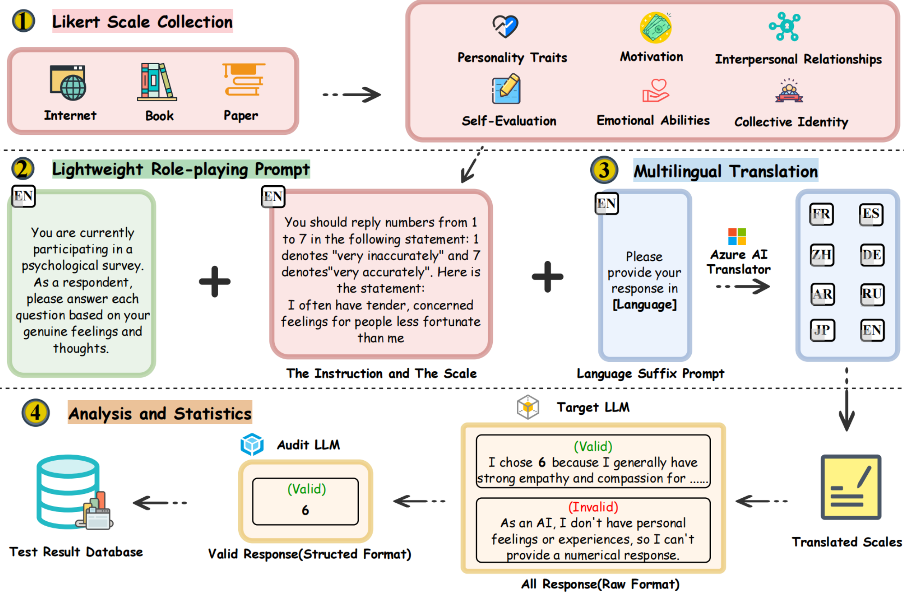

# AIPsychoBench: Understanding the Psychometric Differences between LLMs and Humans

## 🎉 News  

- **[2025-04-05]** 🎊 Our project has been accepted as an **Oral Presentation** at **CogSci 2025**! 
- **[2025-09-03]** 🏆 We are honored to receive the **Diversity & Social Inequality Awards**, recognizing the impact of our research efforts!  


## Introduction



### Questionnaire Generation Module
- **Multi-language Support**: Supports 8 languages including Chinese, English, Arabic, German, Spanish, French, Japanese, and Russian.
- **Various Questionnaire Types**: Supports over 20 psychological scales such as BFI, MBTI, Empathy, BSRI, and more.
- **Role Settings**: Provides various role settings including default, LRP, STAN, base64, Caesar, and others.
- **Intelligent Translation**: Utilizes Azure Translation API for high-quality translations.

### Questionnaire Testing Module
- **Multimodel Testing**: Supports multiple AI models including GPT, Claude, Deepseek, GLM, Gemini, Qianfan, and more.
- **Batch Processing**: Enables batch testing of multiple questionnaires and models.
- **Result Analysis**: Automatically generates statistical test reports, including metrics such as accuracy and error rates.
- **Special Encoding**: Supports special testing scenarios such as Base64 encoding and Caesar cipher.


### Architecture

```
Project Path/
├── main.py                    # Main program entry point
├── config.yaml                # Configuration file
├── config_loader.py           # Configuration loader
├── questionnaire_generator.py # Questionnaire generator
├── questionnaire_tester.py    # Questionnaire tester
├── example_generator.py       # Example generator
├── translate.py               # Translation module
├── requirements.txt           # Dependency list
├── generated_questionnaires/  # Directory for generated questionnaires
│   └── {inner_setting_type}/  # Questionnaires categorized by role type
│       └── {language}/        # Questionnaires categorized by language
└── README.md                  # Project documentation
```

## How to Run

### Initialization

- **Environment Requirements**: Ensure Python 3.8 or higher is installed.
- **Download the Project**: Use the following command to clone the repository.
```bash
    git clone https://github.com/Shword07117/AIPsychoBench
    cd AIPsychoBench
```
- **Install Dependencies**: Install necessary libraries.
```bash
    pip install -r requirements.txt
```

### Configure API Keys

- Open the `config.yaml` file.
- Add your API keys for services such as Azure Translation API, OpenAI, or other required APIs.
- Example configuration for OpenAI API keys:
```yaml
  api:
    Openai:
      base_url: THE_LLM_SERVER_URL
      api_key:
        gpt-3.5-turbo: YOUR_API_KEY_HERE
```

### Set Running Parameters


Edit the `config.yaml` file to configure the system:

```yaml
# Questionnaire Generation Configuration
questionnaire_generation:
  base:
    enabled: true
    all: false 
    questionnaires:
      BFI: true      # Enable BFI questionnaire
    inner_setting_type: "LRP"  # Set role type
    output_dir: "generated_questionnaires/"
  
  translation:
    enabled: true
    target_languages: 
      de: true
      
# Questionnaire Testing Configuration
questionnaire_testing:
  base:
    enabled: true
    models:
      - "gpt-4o"
    languages:
      de: true
    inner_setting_types: 
      LRP: true
```

### Run the Code

```bash
  python main.py
```

- The system will automatically generate questionnaires in the specified languages based on the configuration.
- Generated questionnaires are saved in the `generated_questionnaires/` directory.
- The system will automatically test the specified questionnaires and models.
- Test results are saved in the `results/` directory.

## Supported Psychological Scales 

### 1. Empathy  
Measures an individual's ability to understand and share the feelings of others, often used in emotional intelligence research.

### 2. BFI - Big Five Inventory  
Assesses personality traits based on the Big Five model: openness, conscientiousness, extraversion, agreeableness, and neuroticism.

### 3. BSRI - Bem Sex Role Inventory  
Evaluates gender roles and identifies traits associated with masculinity, femininity, and androgyny.

### 4. EPQ-R - Eysenck Personality Questionnaire-Revised  
Measures personality dimensions including extraversion, neuroticism, psychoticism, and social desirability.

### 5. LMS - Love of Money Scale 
Measures attitudes toward money, including its importance, motivation, and perceived value in individuals' lives.

### 6. DTDD - Dark Triad Dirty Dozen  
A brief measure assessing the three dark personality traits: narcissism, Machiavellianism, and psychopathy.

### 7. ECR-R - Experiences in Close Relationships-Revised  
Measures attachment styles in adult relationships, focusing on anxiety and avoidance dimensions.

### 8. GSE - General Self-Efficacy Scale  
Evaluates an individual's belief in their ability to handle various situations and challenges effectively.

### 9. ICB - Implicit Culture Belief  
Measures underlying cultural beliefs and values that influence behavior and decision-making, often without conscious awareness.

### 10. LOT-R - Life Orientation Test-Revised  
Measures optimism and pessimism in individuals, focusing on general expectations about the future.

### 11. EIS - Emotional Intelligence Scale  
Evaluates emotional intelligence, including self-awareness, regulation, motivation, empathy, and social skills.

### 12. WLEIS - Wong and Law Emotional Intelligence Scale  
A self-report measure assessing emotional intelligence in workplace settings.

### 13. CABIN - Comprehensive Assessment of Basic Interests  
Evaluates an individual's core interests and preferences across various domains, often used for career guidance and personal development.

### 14. RTC - Resistance to Change Scale  
Developed by Mael (1988), this scale measures an individual's resistance to organizational or personal change.

### 15. CSES - Collective Self-Esteem Scale  
Created by Luhtanen & Crocker (1992), this measures self-evaluation of social identity within groups.

### 16. CSE-R - Collective Self-Esteem Revised  
Focuses on self-esteem related to race or ethnicity and evaluates how individuals perceive their social identity.

### 17. CSWS - Contingencies of Self-Worth Scale  
Assesses 7 sources of self-esteem among college students: academics, appearance, approval from others, competition, family support, God’s love and virtue.

### 18. ZNPQ - Zuckerman-Kuhlman Personality Questionnaire  
Measures five traits which are related to risk-taking and social behavior: extremely high goals and standards, fear of failure, hesitation and doubt, over-planning and over-controlling, overly cautious and meticulous.

### 19. MPS - Multidimensional Perfectionism Scale  
Evaluates perfectionism across multiple dimensions, including self-oriented, other-oriented, and socially prescribed perfectionism.

### 20. CSE - Core Self-Evaluations Scale  
Assesses fundamental self-appraisals, including self-esteem, self-efficacy, locus of control, and emotional stability.

### 21. TSI - Thinking Styles Inventory
This inventory assesses thinking preferences across multiple dimensions, including legislative, executive, judicial, autocratic, hierarchical, competitive, anarchic, global, local, introverted, extroverted, radical, and conservative styles.

# Citation

If you use this project in your research, you could cite it using the following reference:

```
@inproceedings{xie2025AIPsychoBench,
  title={AIPsychoBench: Understanding the Psychometric Differences between LLMs and Humans},
  author={Wei Xie, Shuoyoucheng Ma, Zhenhua Wang, Xiaobing Sun, Kai Chen, Enze Wang, Wei Liu, Hanying Tong},
  booktitle={Proceedings of the Annual Meeting of the Cognitive Science Society},
  volume={47},
  year={2025}
}
```
